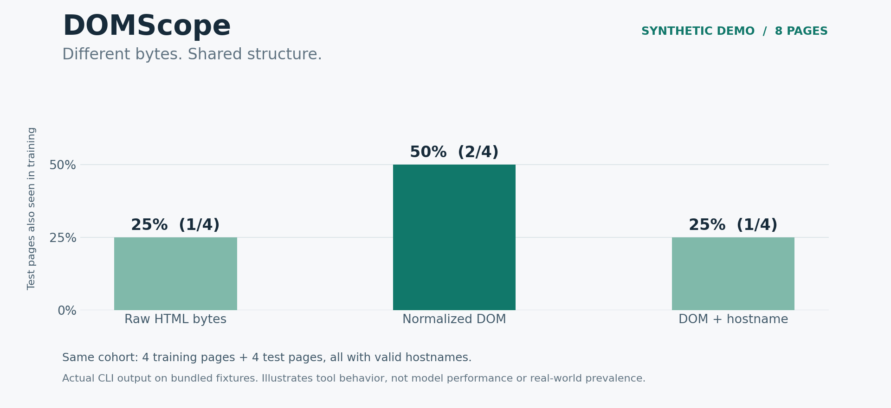
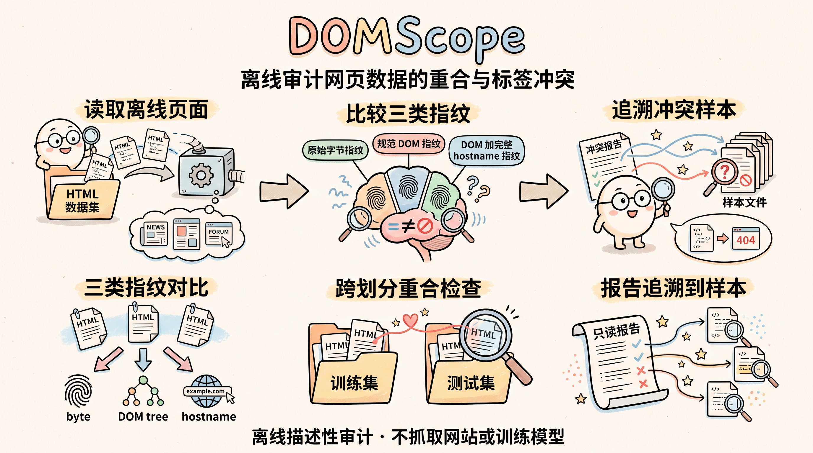

# DOMScope

English | [中文](README_ZH.md)

An offline audit tool for structural overlap and label conflicts in HTML datasets. DOMScope compares saved HTML pages as raw bytes, normalized DOM trees, and DOM plus complete hostname. Its reports trace each result back to individual samples.

离线检查网页数据中的结构重合、跨划分重复与标签冲突。

The CLI computes the audit once. A read-only Streamlit viewer presents the report, sample filters and source snippets. No GPU, model weights or API key is required. The tool does not fetch websites or train a model.



*Actual CLI results from the bundled eight-page synthetic demo. This chart shows tool behavior, not detector performance or real-world prevalence.*



## Run the synthetic demo

Use **Python 3.12 or later**. Open a terminal in the project directory containing `pyproject.toml`.

Windows PowerShell:

```powershell
py -3.12 -m venv .venv
.\.venv\Scripts\Activate.ps1
python -m pip install -e '.[dev]'
```

macOS / Linux:

```bash
python3.12 -m venv .venv
source .venv/bin/activate
python -m pip install -e '.[dev]'
```

If PowerShell blocks activation, use `.\.venv\Scripts\python.exe` in place of `python` and `.\.venv\Scripts\streamlit.exe` in place of `streamlit`; activation is optional.

Create the report, then open its viewer:

```bash
python -m domscope audit --manifest examples/manifest.jsonl --out outputs/demo
streamlit run app.py -- --report outputs/demo/summary.json
```

Open the local URL printed by Streamlit. The viewer defaults to Chinese and offers an English toggle. Use the overview to compare the two sample cohorts, the cases view to inspect samples, and exports to download report artifacts. HTML snippets are displayed as text.

**An existing nonempty output directory is refused.** To rerun the demo, use a new directory such as `outputs/demo-2`, then point the viewer at `outputs/demo-2/summary.json`. The report is not refreshed by reloading the viewer; rerun the CLI after changing inputs.

The eight included pages are **synthetic demonstration data**. Their `0` / `1` labels are deliberately assigned and do not indicate malicious behavior in these inert pages. The expected results can be checked by hand:

| Metric | Expected numerator / denominator |
|---|---:|
| Raw bytes: test → train overlap | 1 / 4 = 25% |
| Normalized DOM: test → train overlap | 2 / 4 = 50% |
| DOM + hostname: test → train overlap | 1 / 4 = 25% |
| DOM overlap among raw-unseen test samples | 1 / 3 ≈ 33.3% |
| DOM empirical conflict error, all labeled samples | 1 / 8 = 12.5% |
| Labeled samples in conflicting DOM groups | 4 / 8 = 50% |

See the [sample table and walkthrough](docs/EXAMPLE.md) for the exact matches and calculations. These constructed values demonstrate the audit method; they are not measurements of real-world prevalence or detector performance.

## Audit your own saved HTML

Place a UTF-8 JSON Lines manifest beside your dataset. Each line is one sample:

```json
{"sample_id":"page-001","html_path":"html/001.html","split":"train","source":"my-dataset","label":0,"hostname":"login.example","encoding":"utf-8"}
```

`html_path` is relative to the manifest directory and must stay inside it after resolving symlinks. `split` is `train`, `val` or `test`; `label` is `0` (benign), `1` (phishing) or `null` (unlabeled). Supply a complete DNS hostname, not a URL. Missing or invalid hostnames remain eligible for raw/DOM auditing but have no joint fingerprint. Omitting `label` or `hostname` means `null`; omitting `encoding` means `utf-8`.

```bash
python -m domscope audit --manifest data/manifest.jsonl --out outputs/my-audit
```

Defaults are 2 MiB per file, 5,000 samples and 50,000 element nodes per page. See `python -m domscope audit --help` for configurable limits and the [method reference](docs/METHOD.md) for the full input contract and failure policy. Recoverable HTML is accepted with parser warnings. Input pages are never silently truncated for hashing.

## Read the results

The **DOM-valid cohort** compares raw bytes and DOM on the same successfully parsed samples. The **hostname-valid cohort** compares all three representations on the subset with valid hostnames. Compare percentages within a cohort: a missing hostname must not silently change the denominator of the main raw/DOM comparison.

Overlap counts each target sample once if its fingerprint occurs anywhere in the training split. A zero denominator is reported as `null` / not applicable. Unknown labels participate in overlap and duplication counts, but not label-conflict metrics. Normalization retains element order, parent/child structure and attribute names; it discards text and attribute values after parsing. Content changes can still affect how the parser builds the tree.

Each run writes six files:

| Artifact | Contents |
|---|---|
| `summary.json` | Metrics, denominators, rules, versions and report metadata |
| `samples.csv` | Per-sample fingerprints, metadata and overlap flags |
| `groups.csv` | DOM groups and member sample IDs |
| `issues.csv` | Exclusions and other recorded issues |
| `cases.jsonl` | Sample IDs and source/normalized-DOM previews with truncation flags |
| `report.md` | A readable audit summary |

Previews are limited to 4,000 characters each; fingerprints use the full accepted input. Reports can contain sensitive source text, hostnames and identifiers. Review all artifacts before sharing them. CSV exports protect spreadsheet formula cells; use JSONL for exact preview and sample-ID text.

## Development and interpretation

Run the local checks with:

```bash
python -m pytest
```

The CI configuration runs this command on Windows and Ubuntu with Python 3.12.

DOMScope provides descriptive dataset auditing. Shared templates, incorrect labels or changes over time can all create mixed-label groups. The empirical conflict error describes the best fit to the current labeled samples for a classifier restricted to this exact DOM representation and one decision per group. It is not a generalization estimate, a bound for every detector, or a reproduced SpecularNet result.

The project is informed by [SpecularNet](https://arxiv.org/abs/2603.01874), which uses domain names and HTML structure, and [PhreshPhish](https://arxiv.org/abs/2507.10854), which discusses leakage and realistic dataset evaluation. DOMScope defines its own normalization and does not claim to reproduce either paper's complete pipeline. See [METHOD.md](docs/METHOD.md) for rules and references.
